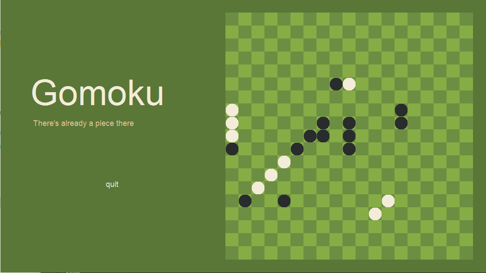
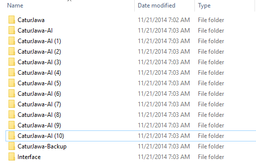

# Gomoku
### Five in a row to win

A java program (with a graphical interface) that plays the game Gomoku. You can play it with two players, or play against the AI!



This is really just my freshman project for the Foundation of Programming class. The requirements were that the game has a graphical interface, but I tried adding an AI as a feature. Well... it sorts of works. The bugs shouldn't be too hard to fix, maybe I'll go fix it someday. But for the time, I was pretty proud of this one :).

```sh
$ javac *.java
$ java Driver
```

Oh, this was the archaic version control system that I used before finding Git:
